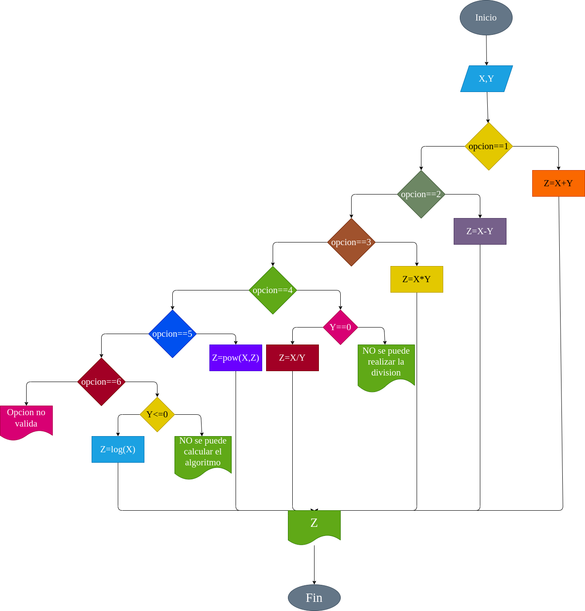

# CALCULADORA BASICA CON MENU

Una calculadora basica se puede realizar con condicione. se desea realizar alguna de las operaciones basicas con dos numeros `X, Y`. Ademas se desea calcular la potencia y el logritmo. se deben de considerar los casos donde `Y=0` donde la division `X/Y` no se puede realizar y cuando `X<=0` donde NO se puede calcular el `log{X}` se desea generar un menu para qe el usuario pueda seleccionar la operacion a realizar. una manera de hacero es la siguiente:

1. se reciben los dos numeros `X,Y` para relizar la operacion.
2. se recibe la operacion a realizar mediante la variable ``opcion` la que selecciona en el menu que operacion ejecuta el algoritmo.
3. Se inicializa la variable logica `bandera=false` si la division a el algoritmo no se pueden calcular. se hace `bandera = true`.
4. Mediante condiciones se realiza la operacion deseada
   * En el caso de la division, si `Y=0` . NO se puede realizar la division, se muestra un mensaje y se hace "bandera=true"
   * En el caso del logaritmo, si `X<=0`. NO se puede calcular el logaritmo; se muestra un mensaje y se hace `bandera = true`.
5. Se muestra el resultado en el caso en que `bandera = false`.  

*Tomado de: Python con aplicaciones a las matematicas, ingenieria y finanzas. Cervante O, Paez D.*

